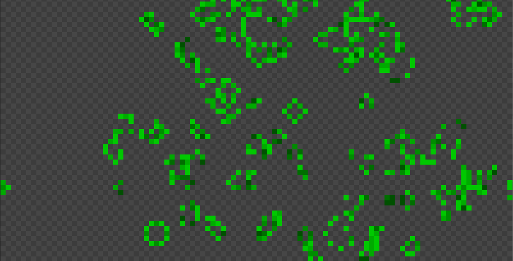

# T15LIFE: Conway's Game of Life.
Last update: 01.10.2021

This project is implemetation of cellular automaton - Conway's Game of Life. There are alive and dead cells on the game field. They status changes depending on
the cell's neighbor count. The younger cell the lighter its color.
Project uses GLUT for window handling, and display the game field.

Some screenshots:

User can dynamicly change status of cells using mouse and keyboard. 
Keymap:
  - LMB - make cell alive
  - RMB - kill cells in the area
  - D, B (+ SHIFT), S (+ SHIFT), G (+ SHIFT), 1 (+ SHIFT), 2 (+ SHIFT), 3 (+ SHIFT) - make some figures of alive cells
  - SPACE - pause/resume (game starts in pause)
  - BACKSPACE - clear field
  - ESCAPE - exit program
  - '+' - increase cells undate speed
  - '-' - decrease cell update speed
